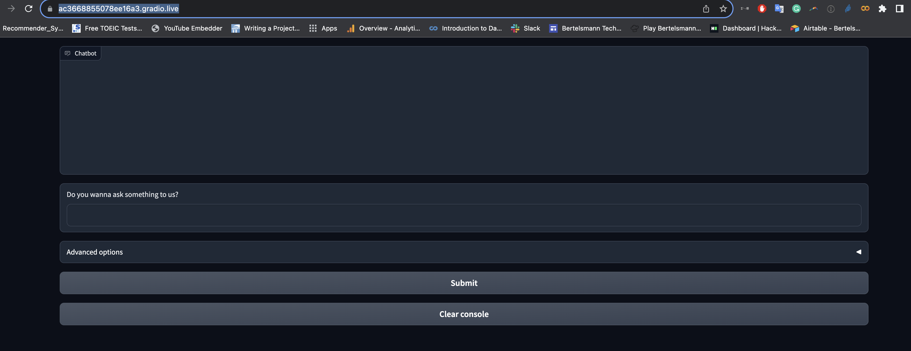

# Chatbot for Myanmar Data Tech Team

This repository contains a chatbot developed for the MMTD (Myanmar Data Tech) project. The chatbot is built based on the principles outlined in the course "Building Generative AI Applications with Gradio" by deeplearning.ai.

## Local Testing

To test the chatbot on your local machine, follow these steps:

### Prerequisites

1. Create an account on [Hugging Face](https://huggingface.co/).
2. Generate an API key in your Hugging Face account settings.
3. Create an inference endpoint on [Hugging Face's Inference Endpoints](https://huggingface.co/inference-endpoints). 
Note that you'll need a credit card to register an endpoint.

### Requirements

1. Hugging Face API Token
2. Hugging Face Endpoint

### Setup

1. Clone this repository to your local machine.
2. Create a `.env` file in the repository root with the following format:

    ```plaintext
    HF_API_KEY=your_api_key
    HF_API_ENDPOINT=your_endpoint
    PORT=your_desired_port
    ```

3. (Optional) Create a virtual environment for this project.
4. Install the required packages by running:

    ```bash
    pip install -r requirements.txt
    ```

5. Start the chatbot by running:

    ```bash
    python chatbot.py
    ```

6. Once the chatbot is running, you will see a prompt with the following information:

    ```
    Running on local URL:  http://127.0.0.1:8080
    Running on public URL: https://ac3668855078ee16a3.gradio.live
    ```

Now you can enjoy testing the chatbot!

Note: This readme assumes basic familiarity with Git, Python, and command-line interfaces.





